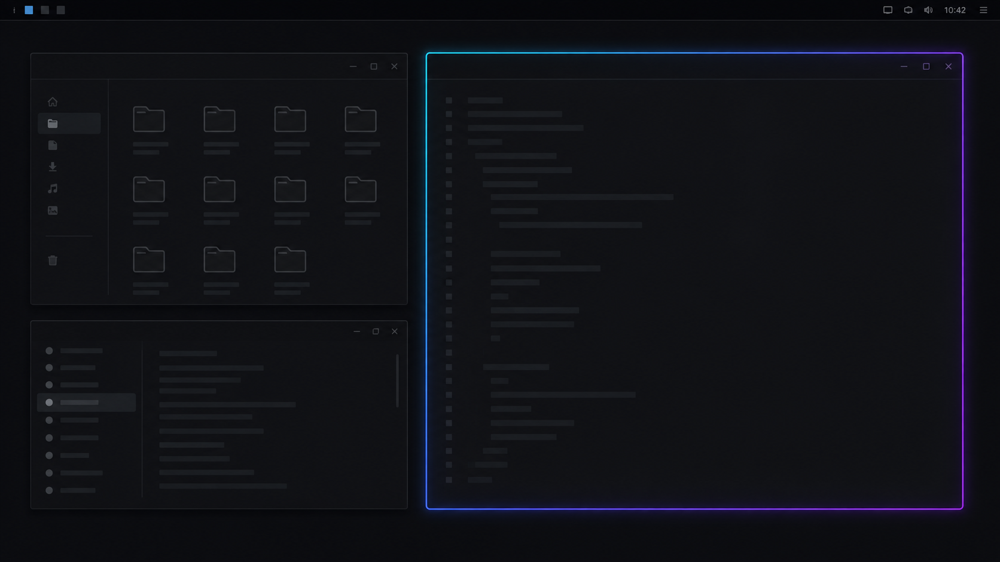

# Omaglow

Animated Omarchy-colored glow for your focused window.

<p align="center">
  
</p>

Omaglow gives the active window a thin cyan, blue, and purple gradient border with a restrained inner glow. Hyprland renders and animates the effect itself. There is no overlay window, focus watcher, or polling process.

## Preview



_Illustrative concept render, not a captured desktop screenshot. The exact glow depends on Hyprland, display scale, refresh rate, and the configured colors._

## What works

- Hyprland owns focus selection, geometry, clipping, and rendering.
- The effect follows tiled and floating windows without an external tracker.
- Focus changes use Hyprland's existing active and inactive decoration states.
- A `configreloaded` event reapplies the runtime settings after a Hyprland reload.
- Disabling the service reloads the user's Lua configuration to restore prior decoration settings.

## Requirements

This prototype targets Omarchy 4.0.1 with Hyprland 0.56.2 and Quickshell 0.3.1. It uses APIs added to the current Hyprland configuration model: `decoration.glow`, `borderangle`, and `glowangle`.

It does not claim support for Omarchy 3, Hyprland 0.54 or earlier, other compositors, or Hyprland builds without the glow options.

## Install

Install from GitHub with Omarchy 4's supported command:

```bash
omarchy plugin add https://github.com/omas-best/omaglow.git --enable
```

For this local checkout:

```bash
mkdir -p ~/.config/omarchy/plugins/community.omaglow
cp -a ./. ~/.config/omarchy/plugins/community.omaglow/
omarchy plugin validate ~/.config/omarchy/plugins/community.omaglow
omarchy-shell shell rescanPlugins
omarchy plugin enable community.omaglow
```

The service applies its defaults when Omarchy Shell loads it. No root access or additional package is needed. See [installation and removal](docs/INSTALL.md) for the development-copy workflow, updates, and uninstall behavior.

## Configure

Copy the documented defaults, edit the copy, then apply it:

```bash
mkdir -p ~/.config/omaglow
cp ~/.config/omarchy/plugins/community.omaglow/config/default.conf \
  ~/.config/omaglow/config.conf
${HOME}/.config/omarchy/plugins/community.omaglow/scripts/omaglowctl apply
```

The available settings are `enabled`, `colors`, `speed`, `intensity`, `radius`, `border_size`, and `opacity`. See [configuration](docs/CONFIGURATION.md) for valid ranges and examples.

## How it is built

The Omarchy service runs one control command when it loads and again after a real Hyprland config reload. The command sends one `hyprctl --batch` request containing documented Lua `hl.config` and `hl.animation` calls. Continuous movement comes from Hyprland's `loop` angle animation; Omaglow does not run a timer or poll window state.

This is deliberately a native compositor effect. It is smaller and less fragile than a C++ Hyprland plugin. The compromise is visible: Hyprland 0.56 calls its native effect an inner glow. Omaglow cannot produce a wide blurred outer halo without moving to a compositor plugin or an input-transparent overlay.

Read the full [architecture decision](docs/ARCHITECTURE.md), including the alternatives and rendering cost.

## Verify and develop

```bash
./tests/test_omaglowctl.sh
./scripts/omaglowctl check
```

The automated tests cover configuration validation, alpha and duration conversion, one-batch application, and reset behavior with a fake `hyprctl`. They do not prove visual output or compositor compatibility. See [development](docs/DEVELOPMENT.md) for the manual matrix that still needs real Omarchy hardware.

## License

MIT. See [LICENSE](LICENSE).
